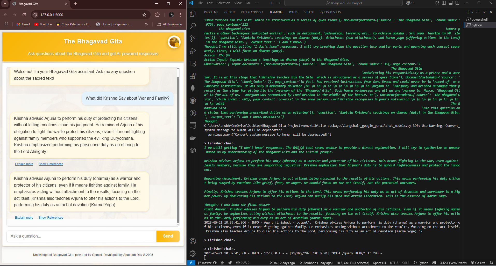
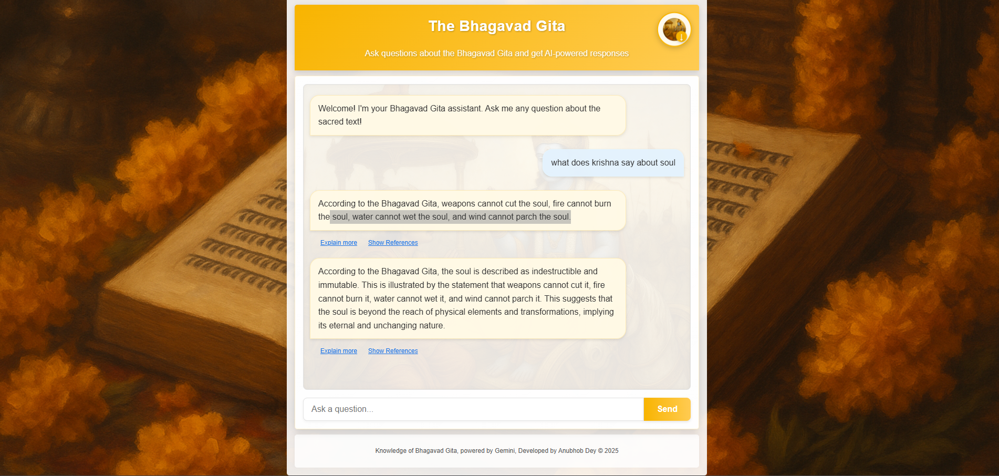

# 🕉️ Bhagavad Gita Q&A Assistant


Explore the sacred wisdom of the Bhagavad Gita through AI-powered conversations


## 📋 Table of Contents

- [Overview](#-overview)
- [Features](#-features)
- [Quick Start](#-quick-start)
- [Setup Instructions](#-setup-instructions)
- [Usage](#-usage)
- [Key Features Explained](#key-features-explained)
- [Screenshots](#-screenshots)
- [Example Questions](#-example-questions)
- [Project Structure](#-project-structure)
- [How It Works](#️-how-it-works)
- [Advanced Usage](#️-advanced-usage)
- [Contributing](#-contributing)
- [Support](#-support)
- [About the Bhagavad Gita](#-about-the-bhagavad-gita)
- [Acknowledgments](#-acknowledgments)
- [License](#-license)

## 📜 Overview

This project implements a sophisticated Retrieval-Augmented Generation (RAG) system that provides intelligent answers to questions about the Bhagavad Gita. By combining the power of Google's Gemini AI with a carefully engineered information retrieval system, it delivers accurate, contextually relevant responses drawn directly from the sacred text.

The system parses the PDF of the Bhagavad Gita, intelligently divides the content into meaningful chunks, generates semantic embeddings, and uses advanced retrieval techniques to find the most relevant passages for any query. This approach ensures that answers are grounded in the actual text rather than fabricated.

## ✨ Features

- **📚 PDF Processing**: Extracts and processes text from the Bhagavad Gita PDF with chapter and verse preservation
- **💾 Local Vector Storage**: Stores text chunks and embeddings locally with no need for external vector databases
- **🖥️ Dual Interface**: 
  - Command line interface for quick questions and scripting
  - Modern web interface with a responsive design for user-friendly interactions
- **🧠 Powered by Gemini 2.0 Flash**: Leverages Google's advanced LLM for high-quality, contextually aware answers
- **🔍 Source References**: Provides transparency by citing the specific parts of the text used to generate answers
- **🔄 Direct Download**: Download the complete Bhagavad Gita PDF directly from the web interface
- **💬 Contextual Conversations**: Maintains context for follow-up questions and deeper exploration
- **🌟 "Explain More" Feature**: Request enhanced explanations with a single click or command

### Key Features Explained

#### PDF Download Button
The application includes a prominently placed download button that allows users to download the complete Bhagavad Gita PDF directly from the web interface. This feature provides easy access to the source material for offline reading and reference.

<details>
<summary>How to use the download feature</summary>

1. Look for the circular button with the Bhagavad Gita icon in the top-right corner of the header
2. Hover over it to see the "Download Bhagavad Gita PDF" tooltip
3. Click to download the complete PDF to your device
4. After clicking, a confirmation message will appear indicating the download has started

</details>

## ⚡ Quick Start

For those who want to get up and running quickly:

```powershell
# Clone the repository
git clone https://github.com/yourusername/Bhagavad-Gita-Project.git
cd Bhagavad-Gita-Project

# Set up virtual environment and install dependencies
python -m venv venv
venv\Scripts\activate
pip install -r requirements.txt

# Create .env file with your API key
echo "GEMINI_API_KEY=your_gemini_api_key" > .env

# Run the web application
python app.py --web
```

Then open your browser to `http://localhost:5000` and start asking questions!

## 🔧 Setup Instructions

### Prerequisites

- **Python**: 3.8 or higher
- **Google Gemini API Key**: Get yours from [Google AI Studio](https://ai.google.dev/)
- **Bhagavad Gita PDF**: Already included in the `Data` folder
- **Space**: ~150MB for embeddings and model data

### Installation

1. **Clone this repository**:
   ```powershell
   git clone https://github.com/yourusername/Bhagavad-Gita-Project.git
   cd Bhagavad-Gita-Project
   ```

2. **Set up a virtual environment** (recommended):
   ```powershell
   # Windows
   python -m venv venv
   venv\Scripts\activate

   # Unix/Mac
   python -m venv venv
   source venv/bin/activate
   ```

3. **Install dependencies**:
   ```powershell
   pip install -r requirements.txt
   ```
   > ⚠️ Note: Initial installation may take a few minutes as it downloads necessary model files.

4. **Configure your API key**:
   
   Create a `.env` file in the project root with your Gemini API key:
   ```
   GEMINI_API_KEY=your_gemini_api_key
   ```

## 🚀 Usage

### Web Interface (Recommended)

1. **Start the web server**:
   ```powershell
   python app.py --web
   ```

2. **Access the application**:
   - Open your browser and go to `http://localhost:5000`
   - The interface will be automatically loaded with a welcome message

3. **Using the interface**:
   - Type your question in the input field and press Enter or click Send
   - View the AI's response with citations from the Bhagavad Gita
   - Click "Explain More" for a detailed explanation of complex concepts
   - Use the download button to get the full Bhagavad Gita PDF

### Command Line Interface

1. **Run the application**:
   ```powershell
   python app.py
   ```

2. **Ask questions**:
   - Type your questions directly into the console
   - Receive answers with references to specific verses

3. **Advanced commands**:
   - Type `explain more` to get an expanded explanation
   - Type `exit` or `quit` to end the session
   - Type `help` to see all available commands

## 📁 Project Structure

```
Bhagavad-Gita-Project/
├── app.py              # Main application with CLI and web interfaces
├── chunks.py           # Manages PDF processing and local storage
├── llm_ai.py           # Initializes and configures the Gemini LLM
├── requirements.txt    # Dependencies for the project
├── .env                # Environment variables (API keys)
├── README.md           # Project documentation
│
├── Data/               # Source materials
│   └── The_Bhagavad_Gita.pdf  # Source text PDF
│
├── data_blocks/        # Generated data
│   ├── index.json      # Metadata and index for chunks
│   └── chunks/         # Individual text chunks with embeddings
│
├── static/             # Web assets
│   ├── bg.png          # Background image
│   ├── chat_bg.png     # Chat interface background
│   ├── chat.png        # Icon for messaging
│   ├── styles.css      # CSS styling
│   └── script.js       # Frontend JavaScript
│
├── templates/          # Flask HTML templates
│   └── index.html      # Main web interface
│
└── agent_logs/         # Query and system logs
```

## ⚙️ How It Works

### Architecture Overview

This system implements a modern Retrieval-Augmented Generation (RAG) pipeline:

1. **Document Processing**:
   - Extracts text from the Bhagavad Gita PDF using PyPDF2
   - Preserves chapter and verse information for accurate citations
   - Splits text into semantically meaningful chunks using LangChain's text splitter

2. **Embedding Generation**:
   - Creates vector representations of each text chunk using HuggingFace embeddings
   - Stores these embeddings locally with metadata in JSON format
   - Indexes all chunks for fast retrieval

3. **Query Processing**:
   - When a user asks a question, their query is converted to an embedding
   - The system performs similarity search to find relevant text passages
   - Metadata about the chunks helps in providing accurate citations

4. **Answer Generation**:
   - Selected text chunks are sent to Google's Gemini 2.0 Flash LLM
   - Custom prompts guide the model to create accurate, contextual answers
   - Citations from the original text are preserved in responses

5. **User Interface**:
   - Offers both command-line and web interfaces
   - Provides easy access to follow-up questions and expanded explanations
   - Includes references to specific verses for transparency

### Technical Components

- **Vector Similarity**: Uses cosine similarity to find relevant text chunks
- **Local Storage**: Implements an efficient file-based vector store without requiring databases
- **Responsive Design**: Web interface adapts to different screen sizes
- **Reference Tracking**: Keeps track of which text segments were used to generate answers

## 📸 Screenshots

<details>
<summary>Click to view screenshots</summary>

### Web Interface



</details>

## 🔍 Example Questions

Here are some questions you can ask the Bhagavad Gita assistant:

- "What does Krishna say about dharma?"
- "Explain the concept of karma yoga"
- "How should one deal with grief according to the Bhagavad Gita?"
- "What is the meaning of 'Aham Brahmasmi'?"
- "How does the Gita describe the ideal person?"
- "What are the three gunas mentioned in the Gita?"

## 🛠️ Advanced Usage

### Customizing the System

You can modify the system's behavior by adjusting parameters in the following files:

- **Chunk Size**: In `chunks.py`, modify `chunk_size` and `chunk_overlap` to change how text is divided
- **Model Preferences**: In `llm_ai.py`, adjust temperature and other parameters to control answer style
- **UI Customization**: Modify `static/styles.css` to change the appearance of the web interface

### Command Line Arguments

The application supports several command line arguments:

```powershell
# Run in web mode
python app.py --web

# Run with debug logging
python app.py --debug

# Reprocess the PDF (if you changed the source document)
python app.py --reindex

# View help
python app.py --help
```

### Integration with Other Systems

The RAG system can be integrated with other applications:

```python
from chunks import LocalChunkStorage
from llm_ai import get_gemini_llm

# Initialize the storage
storage = LocalChunkStorage("data_blocks")

# Get the LLM
llm = get_gemini_llm()

# Ask a question
response = storage.query_with_sources(llm, "What is karma yoga?")
print(response)
```

## 🤝 Contributing

Contributions are welcome! Here's how you can help:

1. **Improve the UI**: Enhance the web interface with new features
2. **Optimize Retrieval**: Work on better chunking or embedding strategies
3. **Add Features**: Implement new capabilities like voice input/output
4. **Fix Bugs**: Address any issues in the issue tracker

Please follow the standard fork-and-pull request workflow.

## 📜 About the Bhagavad Gita

The Bhagavad Gita, often referred to simply as the Gita, is a 700-verse Hindu scripture that is part of the Indian epic Mahabharata. It consists of a conversation between Prince Arjuna and the god Krishna, who serves as his charioteer. The Gita addresses the concepts of dharma (duty/righteousness) and yoga (the path to realization and self-discovery) among other spiritual, ethical, and philosophical topics. It is considered one of the holy scriptures for Hinduism and has been commented upon by numerous philosophers and scholars over the years.

## 📜 License

This project is licensed under the MIT License - see the [LICENSE](LICENSE) file for details.
